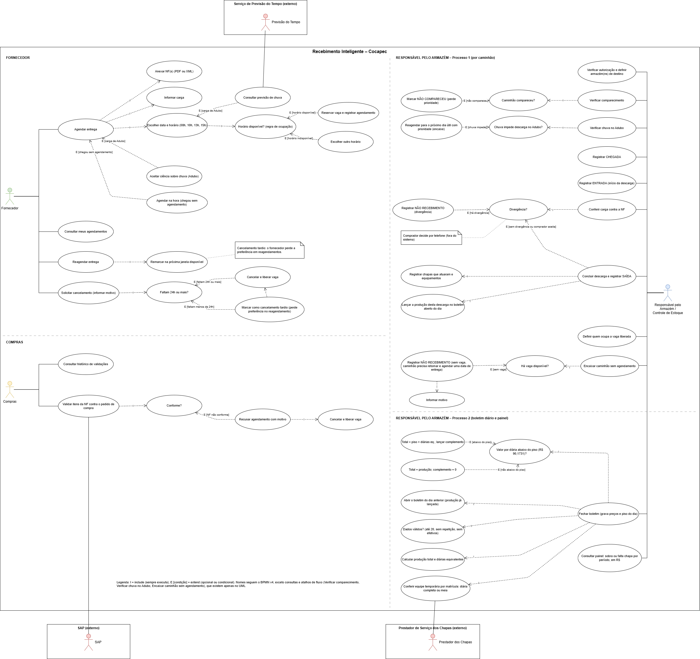

O diagrama de casos de uso mostra o que cada ator faz no sistema; a ordem das etapas está no BPMN.

| Ator | Casos de uso principais |
| --- | --- |
| **Fornecedor** | Agendar entrega, consultar meus agendamentos, reagendar entrega, solicitar cancelamento (informar motivo) |
| **Compras** | Validar itens da NF contra o pedido de compra, consultar histórico de validações |
| **Responsável pelo Armazém** | Verificar autorização e armazém de destino, verificar comparecimento, registrar chegada, entrada e saída, conferir carga contra a NF, definir quem ocupa a vaga liberada, encaixar caminhão sem agendamento, fechar o boletim, consultar o painel |
| **Previsão do Tempo** (externo) | Fornece a previsão usada em Consultar previsão de chuva |
| **SAP** (externo) | Fornece o pedido de compra usado na validação da NF |
| **Prestador dos Chapas** (externo) | Fornece a presença usada em Conferir equipe temporária |

### Como ler o diagrama:
- **I (include)** é uma parte que sempre acontece dentro do caso de uso.
- **E (extend)** é uma variação condicional, com a condição entre colchetes, por exemplo `[há divergência]`.
- Os nomes seguem o BPMN, exceto as consultas e os atalhos de fluxo (Verificar comparecimento, Verificar chuva no Adubo, Encaixar caminhão sem agendamento), que existem apenas no UML.
- Fornecedor, Compras e Responsável pelo Armazém ficam dentro da fronteira do sistema. Os atores externos ficam fora, em raias separadas.
