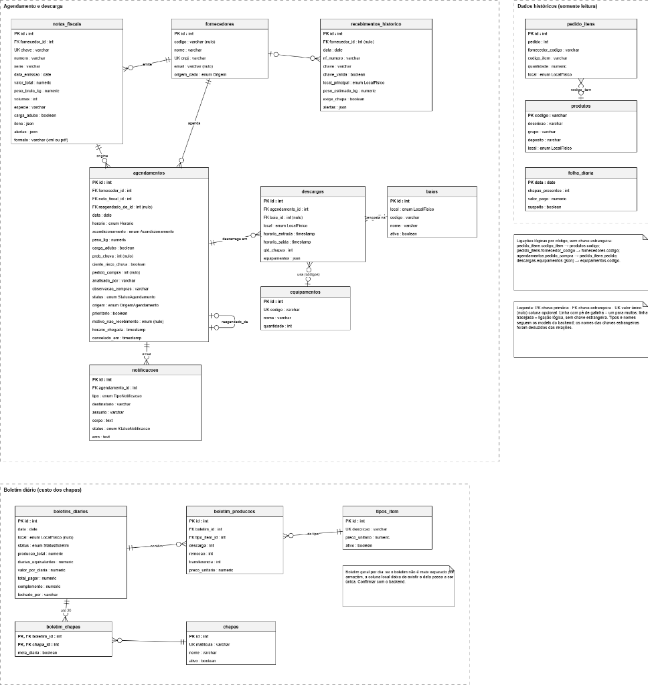

O DER tem 16 tabelas em três grupos e foi montado a partir do diagrama de classes do backend, que a equipe gerou do código dos models e services.

### Tabelas por grupo

| Tabela | Grupo | Chaves e relações |
| --- | --- | --- |
| `fornecedores` | Agendamento e descarga | PK id; cnpj único; tem 0 ou mais notas, agendamentos e recebimentos históricos |
| `notas_fiscais` | Agendamento e descarga | PK id; chave única; FK fornecedor_id |
| `agendamentos` | Agendamento e descarga | PK id; FK fornecedor_id, nota_fiscal_id e reagendado_de_id (a própria tabela); no máximo 1 agendamento ativo por nota |
| `descargas` | Agendamento e descarga | PK id; FK agendamento_id e baia_id (opcional); uma por armazém |
| `baias` | Agendamento e descarga | PK id; docas de cada armazém |
| `equipamentos` | Agendamento e descarga | PK id; codigo único; ligado às descargas por código (json), sem FK |
| `notificacoes` | Agendamento e descarga | PK id; FK agendamento_id; e-mails ao fornecedor |
| `boletins_diarios` | Boletim diário | PK id; um boletim por dia; coluna local opcional (ver pendências) |
| `boletim_producoes` | Boletim diário | PK id; FK boletim_id e tipo_item_id |
| `boletim_chapas` | Boletim diário | PK composta (boletim_id, chapa_id), deduzida; até 20 por boletim; meia_diaria |
| `chapas` | Boletim diário | PK id; matricula única |
| `tipos_item` | Boletim diário | PK id; descricao única; preço unitário |
| `recebimentos_historico` | Dados históricos | PK id; FK fornecedor_id opcional |
| `pedido_itens` | Dados históricos | PK id; ligado a produtos e fornecedores por código, sem FK |
| `produtos` | Dados históricos | PK codigo; depósito e armazém |
| `folha_diaria` | Dados históricos | PK data; chapas presentes e valor pago por dia |

O fornecedor tem notas fiscais e agendamentos. O agendamento gera descargas (uma por armazém, porque um caminhão pode descarregar em mais de um) e notificações, e pode apontar para o agendamento que o originou. Cada descarga encosta em uma baia opcional. O boletim contém linhas de produção, ligadas a um tipo de item, e até 20 chapas por dia.

O campo `origem_dado` (`HISTORICO`, `SISTEMA` ou `TESTE`) aparece em `fornecedores` no diagrama de classes.

**Pontos a confirmar com o backend:** A coluna `boletins_diarios.local` é opcional: como o boletim agora é geral por dia, ela deve sair e `data` deve ser única (o diagrama de estados já chama o boletim de "um geral por dia"). Os nomes das chaves estrangeiras e a chave composta de `boletim_chapas` foram deduzidos das relações. Para conferir o schema real, use o Adminer (porta 8080 do Docker Compose) ou o diagrama ER do DBeaver.
